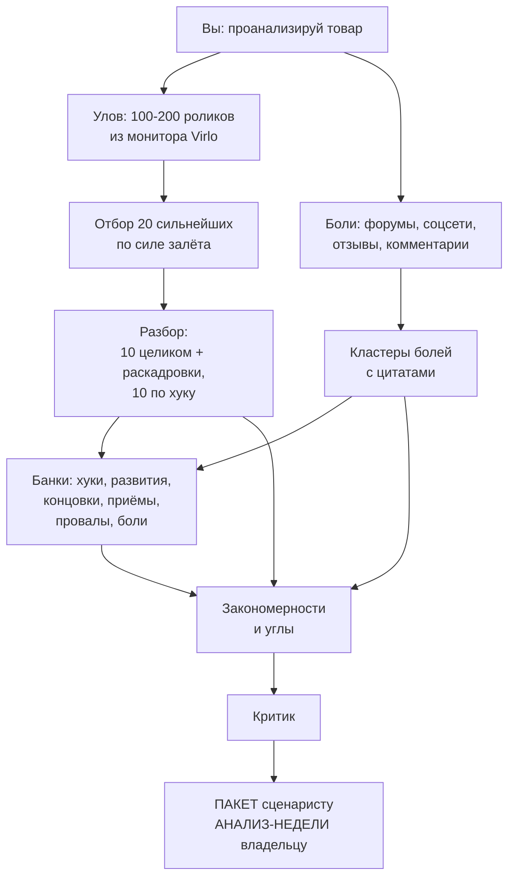

# Анализ трендов — агенты для Claude Code

Набор агентов, который отвечает на два вопроса по любому товару:
**что сейчас работает в этой нише** и **что болит у покупателей их
собственными словами**.

На выходе — готовый материал для сценариев роликов: разобранные чужие
хуки, живые цитаты людей, идеи что снимать.

**Языки:** русский · [Հայերեն](README.hy.md) · [English](README.en.md)
**Схема работы одной страницей:** [docs/scheme.html](docs/scheme.html)

---

## Главное, что нужно понять сразу

**Вам не нужно ничего программировать и почти ничего делать руками.**
Всё делает Claude. Вы даёте ему задачу словами — он скачивает, ставит,
заполняет файлы, ищет, разбирает и складывает результат.

Ваша роль в трёх местах:

1. завести аккаунт Virlo и вставить ключ (5 минут, один раз);
2. **рассказать Claude про свой товар своими словами** — он сам оформит
   это в нужный файл;
3. прочитать результат и решить, что снимаем.

Всё остальное — работа агентов.



---

## Установка — одной фразой

Скачайте репозиторий и скажите Claude Code, открытому в этой папке:

> установи

Дальше он всё сделает сам: проверит Python, поставит yt-dlp,
faster-whisper и OpenCV, найдёт ffmpeg, скопирует 19 агентов в вашу
папку агентов, разложит рабочие папки. В репозитории лежит `CLAUDE.md` —
Claude читает его первым и знает порядок.

Если предпочитаете запустить руками:

```
python setup.py
```

Скрипт напечатает два списка: что готово и что осталось. Всё, что
осталось, покажите Claude — он доведёт до конца.

**Единственное, что делаете вы, — заводите аккаунт Virlo** (шаг 1 ниже)
и присылаете ключ Claude. Остальное не требует ни команд, ни знания папок.

После установки перезапустите Claude Code, чтобы он увидел новых агентов.

---

## Что нужно до старта

| Что | Зачем | Сколько стоит |
|---|---|---|
| **Подписка Claude** | без неё агенты не запустятся | по тарифу Anthropic |
| **Claude Code** | среда, где живут агенты | входит в подписку |
| **Аккаунт Virlo** | источник данных о роликах | ~$12 в месяц |
| Python, ffmpeg | скачивание роликов и расшифровка речи | бесплатно |

**Claude Code:** https://claude.com/product/claude-code
**Virlo:** https://virlo.ai

---

## Шаг 1 · Ключ Virlo — с этого начинается всё

Без ключа анализ не заработает: неоткуда брать ролики.

1. Откройте **https://virlo.ai** и зарегистрируйтесь по почте.
2. Подтвердите письмо, войдите в кабинет.
3. Пополните баланс — месяц работы стоит около **$12**.
4. Найдите раздел **API** (бывает называется Developers, Integrations
   или API Keys) и создайте ключ.
5. **Скопируйте его сразу** — второй раз он обычно не показывается.
   Выглядит так: `virlo_tkn_` и дальше набор букв и цифр.

Дальше отдайте ключ Claude — он вставит его куда нужно. Скажите ему:

> Подключи Virlo как MCP-сервер в мой .claude.json. Адрес
> https://dev.virlo.ai/api/mcp/mcp, транспорт http, заголовок
> Authorization со значением «Bearer ВАШ_КЛЮЧ». После этого напомни
> мне перезапустить Claude Code.

Перезапустите Claude Code и проверьте:

> Проверь баланс Virlo

Увидели число — всё работает. Проверка бесплатная.

> **Ключ — это доступ к вашим деньгам на балансе.** Не выкладывайте его
> в чаты, скриншоты и репозитории.

---

## Шаг 2 · Установка

Всё описано выше — «установи», и Claude сделает. Проверить результат:

```
python doctor.py
```

Скрипт по пунктам скажет, что готово, а что доставить. Не понимаете
вывод — покажите его Claude.

---

## Шаг 3 · Расскажите про свой товар

Здесь нужны именно вы: агент не знает вашего продукта.

**Не заполняйте файлы руками.** Просто расскажите Claude про товар
своими словами — как рассказали бы знакомому. Чем подробнее, тем лучше
получится анализ.

> Заведи новый товар: <название>. Вот что это такое: <рассказывайте
> свободно — что делает, из чего, сколько стоит, где продаётся, как
> выглядит упаковка, для кого, чем лучше других, чего не умеет>.
> Вот ссылка на витрину: <ссылка>. Заполни карточку товара, запреты
> и темы для поиска болей по шаблонам из папки templates.

Claude сам создаст шесть файлов. **Руками с нуля не заполняется ничего** —
он пишет черновик, вы читаете и правите:

| Файл | Что в нём | Что нужно от вас |
|---|---|---|
| `card.md` | всё о товаре: назначения, состав, цена, упаковка | вычитать, дописать назначения |
| `claims.md` | что нельзя обещать в этой категории | добавить свои ограничения |
| `pain-topics.md` | темы, по которым искать жалобы людей | **вычитать обязательно** |
| `trend-keys.md` | ключевые слова для поиска (английские) | просмотреть, убрать лишнее |
| `visual-book.md` | какие сцены реально снять | **наполнить самому** |
| `results.md` | замеры ваших роликов | вписывать цифры после публикаций |

**В каждом файле написано прямо внутри**, кто его заполняет, что нужно
от вас и чем грозит пропуск. Откройте — и увидите подсказку у каждого
раздела.

Два места, где человек незаменим:

- **`pain-topics.md`** — по нему пойдёт весь поиск болей. Что там
  написано, то и найдётся; ошибка отравляет весь анализ.
- **`visual-book.md`** — что можно снять вашими руками, агент знать
  не может. Оставите пустым — получите идеи, которые не снимете.

### Если анализ нужен не на русском

В карточке товара есть строка **«Язык результата»**. Поставьте туда язык
того, кто будет работать с материалом, — и пакет, анализ недели и все
семь банков придут на нём.

> Заведи товар с языком результата: армянский

Что при этом **не переводится**: оригиналы чужих хуков (банк хранит их
дословно — в этом весь смысл) и цитаты людей (это язык аудитории, ради
него их и собирали). Перевод идёт строкой рядом.

Готовый словарь рабочих терминов есть для армянского —
`config/armenian-terms.md`. Для другого языка агент заведёт свой
и покажет вам на подтверждение: без общего словаря каждый прогон назовёт
хук по-своему и банки перестанут быть сравнимыми.

**Честное предупреждение.** Боли ищутся на русском: армянские бытовые
обсуждения живут в закрытых группах и поисковиками не индексируются.
Поэтому в армянском пакете выводы будут армянскими, а цитаты людей
останутся русскими с переводом рядом.

---

**Дальше файлы живут сами.** Скажете по ходу разговора «кстати, он ещё
и для обуви годится», «цену подняли», «людям не нравится запах» — Claude
допишет это в нужный файл и коротко скажет, что обновил. Помнить,
в каком файле что лежит, не нужно.

**Править руками тоже можно и нужно.** Это обычные текстовые файлы:
открывайте и дописывайте всё, что знаете о товаре. Чем точнее описан
продукт, тем сильнее анализ — тут ручная правка работает лучше любого
автомата.

Прочитайте, что он написал, и поправьте, если что-то не так. **Это самое
важное место во всей работе:** скупое описание товара даёт слабый анализ.
У нас был случай, когда из-за короткой карточки агент решил, что целая
категория применения «не наша», и выбросил четыре готовые идеи.

---

## Шаг 4 · Запуск анализа

> Проанализируй <товар>

Всё. Дальше агент работает сам два — два с половиной часа и приносит результат.

Первый анализ нового товара занимает примерно день — нужно собрать
данные с нуля.

---

## Первый запуск: чего ожидать

**Монитор Virlo собирает раз в неделю.** Он создаётся мгновенно
и бесплатно, но данные в нём появятся только к следующему воскресенью.
Поэтому при заведении первой ниши Claude **сразу запускает разовый
поиск** — $0.50, готов через 15–20 минут. Улов будет сегодня, а дальше
монитор собирает сам.

Так что первый анализ нового товара выглядит так:

```
завели товар ................. минуты
разовый поиск ................ 15–20 минут ожидания
поиск болей .................. идёт параллельно
разбор, банки, пакет ......... 2–2,5 часа
```

**Если денег на балансе нет**, Claude скажет прямо: улов появится
в воскресенье, раньше анализировать нечего. Он не будет делать вид,
что работает.

**Проверить баланс** можно в любой момент, это бесплатно:

> проверь баланс Virlo

---

## Что происходит внутри, пока вы ждёте

Понимать это необязательно, но полезно.

| Что делает | Простыми словами |
|---|---|
| Читает улов Virlo | берёт сотню-две роликов, собранных за неделю по вашей теме |
| Отбирает двадцать | не самые просматриваемые, а самые «выстрелившие» относительно размера автора |
| Ищет боли | четыре помощника одновременно читают форумы, соцсети, отзывы и комментарии |
| Разбирает двадцать глазами | десять целиком с раскадровкой для съёмки, десять по первым трём секундам |
| Замеряет ритм | сколько планов, по сколько секунд каждый, где стоит титр, где звуковые акценты |
| Раскладывает по банкам | каждый хук, приём и ход получает номер |
| Строит идеи | связывает боль людей со свойством товара |
| Проверяет себя | критик судит, хватит ли материала на неделю роликов |

**Почему не по просмотрам.** Ролик на миллион у блогера-миллионника
сработал именем — повторить нечего. Ролик на 50 тысяч у автора с пятью
тысячами подписчиков сработал форматом — вот его и копируем.

---

## Что вы получаете

### Разовое — отчёт об этом анализе

Папка `runs\<дата>\<товар>\`:

| Файл | Кому и зачем |
|---|---|
| **`ПАКЕТ-<товар>.md`** | **главный.** Отдаёте сценаристу: механика ниши, чужие хуки дословно, боли с цитатами, готовые идеи роликов |
| `АНАЛИЗ-НЕДЕЛИ-<товар>.md` | вам. Картина ниши на пять минут чтения: что сработало, что провалилось, что делать |
| `refs\` | скачанные ролики, кадры, расшифровки речи |

### Накопительное — имущество товара

Папка `products\<товар>\banks\` — семь файлов, которые растут
с каждым анализом:

| Файл | Что копит |
|---|---|
| **`pains.md`** | **боли `P-001…`: повтор увеличивает счётчик, новая боль помечается** |
| `hooks.md` | хуки: первые секунды, из-за которых не пролистнули |
| `development.md` | развития: что происходит после хука и чем держит |
| `endings.md` | концовки и призывы |
| `techniques.md` | приёмы съёмки: ракурс, движение камеры, монтаж |
| `fails.md` | провалы: что пробовали и не взлетело |
| `combos.md` | связки, подтверждённые вашими замерами |

> **Пакет — газета за сегодня:** прочитали и выбросили.
> **Банки — библиотека:** растут с каждым анализом и работают годами.

### Как накопление делает анализ точнее

**Счётчики.** Хук, встретившийся у разных авторов второй и третий раз, —
уже не случайность, а живучая механика ниши. Боль, подтверждённая
в трёх прогонах, точно живая. Через месяц по счётчикам видно, что
устойчиво, а что было волной.

**Индекс вместо чтения всего подряд.** Банки растут до тысяч строк,
поэтому рядом с ними лежит `banks/ИНДЕКС.md` — каталог на 100–150 строк:
номера, названия, статусы, счётчики, под какую боль. Агент читает его
и открывает точечно только нужные записи. Сначала каталог, потом
страница — иначе с ростом банков каждый прогон дорожал бы.

**Отчёт раз в месяц.** `banks/ОТЧЁТ-БАНКОВ.md`: какие механики держатся,
что мы уже много раз снимали, что лежит нетронутым, какие боли
возвращаются, где банк недособран.

```
python lib/bank_report.py index  products/<товар>/banks
python lib/bank_report.py report products/<товар>/banks
```

**Чего накопление не делает.** Модель на ваших файлах не дообучается:
умнее становится не она, а база, которую она читает. И пока вы не
опубликовали ролики и не сняли цифры, банк хранит **чужой** опыт —
все статусы остаются гипотезами.

### Что замыкает петлю — `results.md`

Рядом с банками лежит таблица замеров `products/<товар>/results.md`.
После публикации скажите Claude:

> Запиши замеры: ролик по H-007, развитие R-012, 12 тысяч просмотров
> за неделю, ссылка такая-то

Он найдёт строку и впишет. Дальше система делает то, чего не даст
никакой анализ чужих роликов:

- **статусы в банке хуков** — какой хук сработал **у вас**, а какой нет;
- **связки** в `banks/combos.md` — комбинации с подтверждённым
  результатом вместо гипотез;
- **счётчик «у нас»** — видно, что уже изношено повторами.

Замеры живут **внутри папки товара** и едут вместе с ней: система
не зависит от того, есть ли у вас отдельные журналы публикаций.

---

## Как всё это использовать

**1. Прочитайте `АНАЛИЗ-НЕДЕЛИ`** — пять минут. Поймёте, что вообще
работает в вашей нише и куда двигаться.

**2. Отдайте `ПАКЕТ` тому, кто пишет сценарии** — себе, сотруднику или
другому агенту. В нём уже есть идеи роликов с обоснованием: какая боль,
какой хук, какой формат.

**3. Снимайте по деталям из банков.** Берёте хук из `hooks.md` одного
ролика, развитие из `development.md` другого, концовку из `endings.md`
третьего — получается не копия, а своя сборка из проверенных частей.
Из двадцати хуков и двадцати развитий выходит четыреста комбинаций.

**4. Замеряйте и возвращайтесь.** Когда ролики опубликованы и посчитаны,
скажите Claude, что сработало — он проставит хукам статусы и запишет
удачные связки. Со временем банк перестаёт быть чужим опытом
и становится вашим.

---

## Где живёт сам агент

**Агенты лежат в этом репозитории** — папка `agents/`, 19 файлов `.md`.
Вы их скачиваете вместе со всем остальным и копируете в папку агентов
своего Claude Code:

```powershell
Copy-Item agents\*.md "$env:USERPROFILE\.claude\agents\"
```

После этого агент и данные живут в разных местах:

```
C:\Users\<ваше имя>\.claude\agents\     ← агенты работают отсюда
C:\Users\<ваше имя>\.claude.json        ← ключ Virlo

<ваша рабочая папка>\                   ← все данные
├── config\  lib\  products\  runs\
```

**Агент — это инструкция, а не программа.** Файл `.md`, который Claude
читает перед работой. Отсюда три следствия:

- **19 агентов обслуживают все ваши товары** — они ничего не помнят
  между запусками, вся память лежит в папке товара;
- **обновить агента = заменить файл** и перезапустить Claude Code;
- **копия в `.claude\agents\` — рабочая, оригинал здесь.** Обновился
  репозиторий — скопируйте файлы заново.

Рабочую папку выбираете вы. Если она не `C:\Ferma\factory`, укажите её
один раз: `setx FACTORY_DIR "D:\ваш\путь"`.

### Кто есть в папке agents\

**Ведёт работу**

| Агент | Что делает |
|---|---|
| `trendy-lead` | оркестратор: ведёт весь цикл, зовёт остальных |

**Разбор чужих роликов**

| Агент | Что делает |
|---|---|
| `ref-downloader` | качает ролик на диск через yt-dlp |
| `ref-analyst` | разбирает ролик на скелет формата |
| `ref-analyst-check` | проверяет разбор по списку да/нет |

**Поиск болей — четыре добытчика работают параллельно**

| Агент | Где ищет |
|---|---|
| `pain-hunter` | охотник: ведёт четвёрку ниже |
| `pain-forum` | форумы, Reddit, вопросы-ответы — основной источник |
| `pain-social` | соцсети, телеграм-каналы |
| `pain-marketplace` | отзывы маркетплейсов |
| `pain-comments` | комментарии под роликами |
| `pain-cluster` | схлопывает цитаты в кластеры с приоритетами |
| `pain-cluster-check` | проверяет кластеры |

**Хранители банков — каждый владеет своим файлом**

| Агент | Что ведёт |
|---|---|
| `bank-keeper` | шесть банков, присваивает номера H R C T F P |
| `combo-keeper` | `combos.md` — только по вашим замерам |
| `hook-scorer` | статусы хуков по вашим результатам |

**Судья**

| Агент | Что делает |
|---|---|
| `trend-critic` | решает, хватит ли материала на неделю ТЗ |

**Заведение товара**

| Агент | Что делает |
|---|---|
| `product-keeper` | карточка товара из ваших слов и витрины |
| `product-claims` | запреты по категории |
| `product-research` | стартовая разведка по новому товару |
| `stock-reels` | разбирает ваш банк готовых роликов |

## Что в какой папке лежит

```
trend-analysis/
  README.md          этот файл
  РУКОВОДСТВО.md     подробное описание всего: термины, установка,
                     девять шагов работы, разбор поломок, чек-лист

  agents/            19 агентов — копируются в папку агентов Claude Code
  config/            правила: пороги отбора, где искать идеи,
                     что нельзя обещать, формат результата
  lib/               скачать ролик, расшифровать речь, посчитать ритм
                     планов и титры, свести статистику улова
  doctor.py          проверка окружения одной командой
  docs/scheme.html   схема работы одной страницей
  CHANGELOG.md       что менялось от версии к версии
  templates/         пустые файлы нового товара и заготовки шести банков
  examples/          два настоящих анализа целиком — читать как образец
```

А вот что появится **у вас на компьютере** во время работы:

```
<рабочая папка>/
  config/                 правила (из репозитория)
  lib/                    скрипты (из репозитория)
  products/<товар>/       ваш товар
    card.md               описание товара
    claims.md             запреты
    pain-topics.md        темы поиска болей
    trend-keys.md         ключевые слова
    banks/                шесть накопительных банков  ← ваш главный актив
    pains/                собранные цитаты людей
  runs/<дата>/<товар>/    результат каждого анализа
```

Правило простое: **`products/` — то, что копится и остаётся.
`runs/` — отчёты по датам, их можно чистить.**

---

## Что читать в первую очередь

1. **Этот файл** — вы уже здесь.
2. **`examples/`** — два настоящих анализа. Полезнее любой документации:
   сразу видно, как выглядит результат.
3. **`РУКОВОДСТВО.md`** — когда захотите разобраться глубже или что-то
   пойдёт не так.

---

## Сколько это стоит в месяц

| Что | Цена |
|---|---|
| Завести монитор ниши | $1.50 один раз |
| Сбор данных | $1.50 в неделю |
| **Читать собранное** | **бесплатно, сколько угодно** |
| Поиск болей, скачивание, расшифровка, разбор | **бесплатно** |

Около **$12 в месяц**. Один монитор обслуживает целую нишу: пять товаров
бытовой химии — один монитор, а не пять.

---

## Честно о границах

**Что этот набор делает хорошо:** находит, что работает в нише прямо
сейчас, приносит живые формулировки людей и раскладывает чужие удачные
ролики на детали, из которых можно собирать свои.

**Чего он не делает:**

- не пишет сценарии и не снимает — даёт материал, а не готовый ролик;
- не знает, что сработает **у вас**, пока вы не опубликуете и не замерите.
  Все правила отбора взяты из чужих результатов — это разумная отправная
  точка, а не гарантия;
- ищет боли на русском языке. Для других языков нужны свои источники;
- зависит от Virlo: нет ключа или баланса — нет свежих данных.

**Главное ограничение честное:** анализ показывает, что сработало
у других. Что сработает у вас, покажут только ваши замеры — и вот тогда
банки начинают отвечать уже на ваш вопрос.

---

## Требования

Claude Code · Python 3.10+ · ffmpeg · аккаунт Virlo с балансом ·
Windows (на других системах правятся пути в скриптах)
